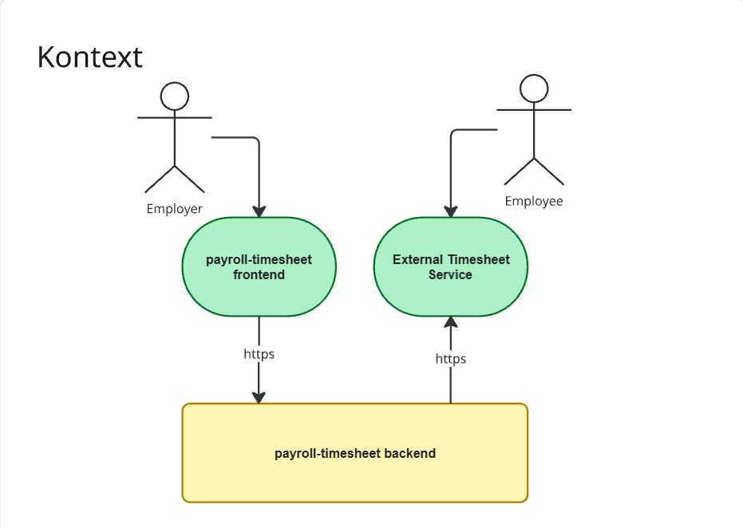
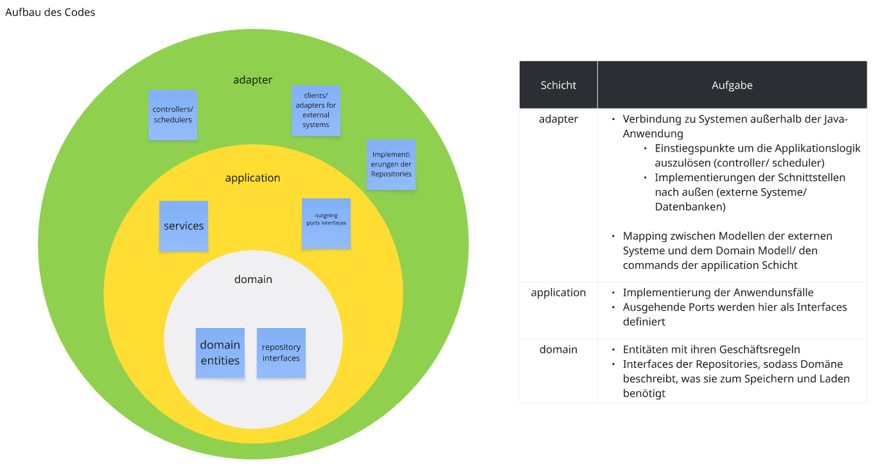

# payroll-timesheet

Spring-Boot-Anwendung zur **tagbasierten Stundenerfassung** (mehrere Tage pro Anfrage, auch über Monatsgrenzen). Architektur grob nach **Onion Architecture**.

## Stack

- Java 17, Spring Boot 3.4  
- Spring Web, Data JPA, Validation  
- H2 (Runtime), Hibernate

## Start

```bash
mvn spring-boot:run
```

Standard-Port: **8080**. Tests: `mvn test`.

## API

- **Stundenzettel speichern:** `POST /api/v1/timesheets`  
  Body: `companyId`, `employeeId`, `days[]` mit `date`, `expectedVersion`, `intervals` (optimistisches Locking je Tag).

## Externe Zeiterfassung

Ein Scheduler importiert Daten über `ExternalTimeTrackingPort`; der zuletzt erfolgreiche Abrufzeitpunkt pro Firma liegt in **`ExternalTimeTrackingLastFetchedPort`** (Persistenz: `external_time_tracking_last_fetched`).


## Konfiguration (`application.yml`):

| Property | Bedeutung |
|----------|-----------|
| `payroll.external-time-tracking.import-interval-ms` | Abstand der Import-Läufe |
| `payroll.external-time-tracking.demo-company-id` | Firmen-ID für den Demo-Import |

## Nicht behandelte Themen
- Authentifizierung/Autorisierung
- Tests
- Fachlichkeit für Arbeitszeiten wie
    - Arbeitszeit über Datumsgrenzen
    - Zeitzonen bei Arbeit im Ausland
    - Freigaben von Prozessen
    - Markieren von Stunden, die für Abrechnungen relevant sind
    - Änderungshistorie
    - Erfasser der Stunden
    - Validierung der Anzahl der Stunden (Begrenzungen)
    - 
## Kontext des Systems


## Aufbau des Codes 

